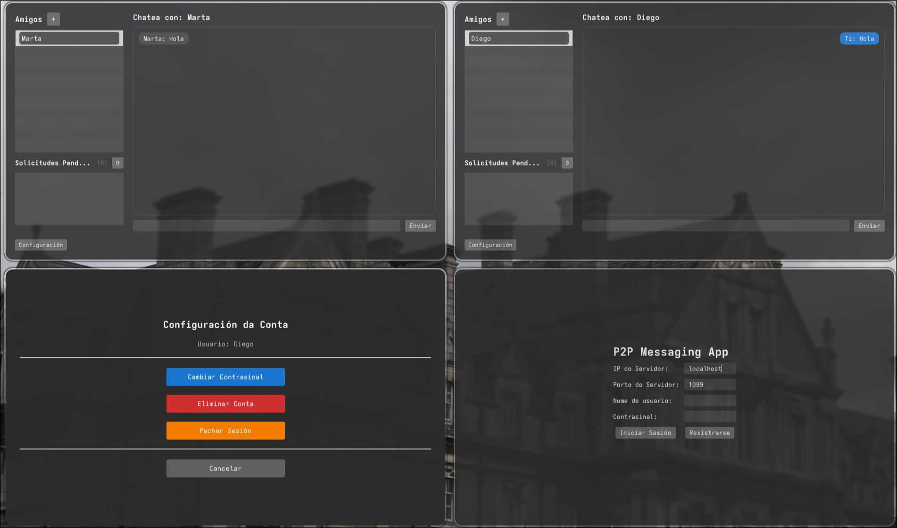

# P2P Messaging App

Simple peer-to-peer messaging app that uses a single RMI server to broker presence and friend requests. GUI client is implemented with JavaFX.




## Requirements
- Java 21
- JavaFX 21 (includes JavaFX dependencies for development)
- Network: server machine must be reachable by clients (open RMI port and any remote object ports if needed).

## Features

- User registration and login
- Change password, delete account
- Friend requests (send / accept / reject)
- Presence notifications (friends online/offline)
- P2P messaging (messages delivered via remote InterfacePeer)
- GUI with consistent dark theme (JavaFX)

## Build
From project root:
```
./gradlew clean build
```

This compiles the project. Two useful Gradle tasks are provided in the script:

- Run server (development): ```./gradlew runServer```
  launches LadoServidor.ObxectoServidor and prompts for RMI registry port.
- Run GUI client (development): ```./gradlew runClient```
  launches LadoCliente.ClienteUI using JavaFX on the Gradle classpath.

## Create distributable JARs
Two fat JAR tasks are available:
- Client fat JAR
```
./gradlew clientJar
# result: build/libs/p2p-client-all.jar 
```
- Server fat JAR
```
./gradlew serverJar
# result: build/libs/p2p-server-all.jar
```

## Run (distributed)
From the root directory:
- Server
```
# from server machine
java -jar build/libs/p2p-server-all.jar
```
```
# via Gradle
./gradlew runServer
```
The server will prompt for a port to create the RMI registry (e.g. 1099)
> If bd.txt and solis.txt are not found, it will throw an error and create the files.   
> Execution is going well, don't worry about that warnings.
- Client
```
java -jar build/libs/p2p-client-all.jar
```
```
# via Gradle
./gradlew runClient
```
The GUI will appear in another window.  
On client startup enter server IP and port (the same port the server created RMI registry on).

> There is an option to run just the terminal client
> ```./gradlew runConsoleClient```

## ❗ Warning
This is educational code, it should not be used in production.  
It contains serious security bugs like saving passwords in plain text.